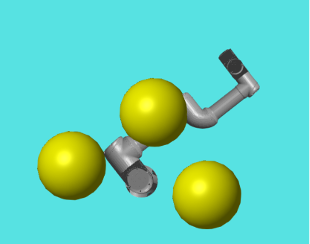

# UR16e Robot Dynamics

This repository contains the course project for *Robotics (Spring 2025)*, completed by  
**Yixiao Liu**, **Yusen Wu**, and **Huaqian Zhao**.

> ⚠️ **Note:** This repository is no longer actively maintained.  
> The code is archived for academic reference only.

---

## 📘 Overview

This project focuses on the **forward and inverse dynamics** of a UR16e 6-DOF industrial manipulator.  

  
   
  <em>Fig. 1. UR16e manipulator with obstacle spheres (simulation visualization).</em>

The implementation includes:
- Kinematic modeling based on Denavit–Hartenberg parameters  
- Symbolic dynamics derivation using the Euler–Lagrange formulation  
- Simulation of joint motion, torque profiles, and end-effector trajectories  
- Visualization and plotting of dynamic responses  

Developed primarily in **MATLAB**, with numerical solvers and plotting utilities for analysis.

---

## 🧠 Learning Objectives

- Understanding rigid-body dynamics of articulated robotic systems  
- Applying the Euler–Lagrange method to multi-link manipulators  
- Implementing forward/inverse dynamics computation  
- Gaining experience in simulation, data analysis, and visualization  

---

## 🧩 File Structure
